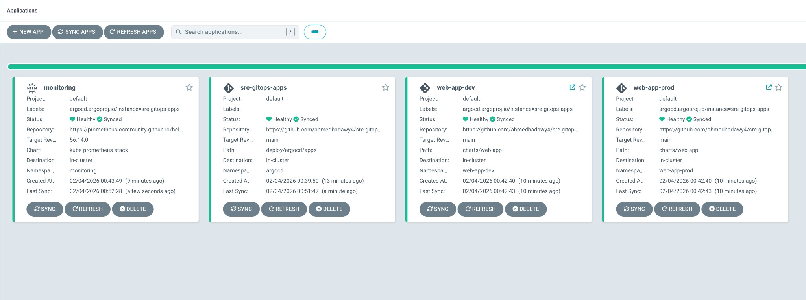
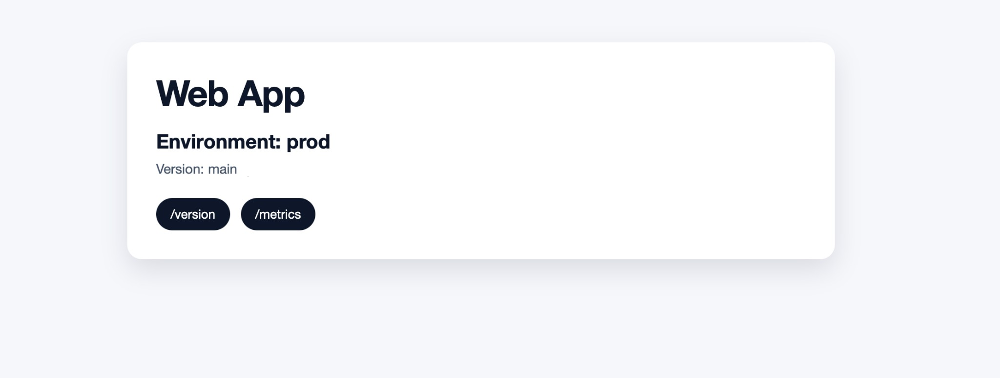

# SRE GitOps

[](https://github.com/ahmedbadawy4/sre-gitops/actions/workflows/pr-checks.yml)

This repository demonstrates a reproducible GitOps setup using Argo CD to deploy a simple web application into Kubernetes.
It focuses on deterministic environments, environment separation (dev/prod), and Git-driven promotion without imperative cluster changes.

## Architecture (high level)

High-level flow:
```
Git Repo (app + Helm)
          |
          v
      Argo CD
          |
          v
 Kubernetes Cluster
   - web-app-dev
   - web-app-prod
```

- Git repo holds application code and Helm chart.
- Argo CD watches the repo and syncs desired state into the cluster.
- Two environments (dev/prod) are separated by namespaces and values files.

## What this demonstrates

- GitOps deployment using Argo CD (app-of-apps pattern).
- Pinned, reproducible Kubernetes and Argo CD versions.
- Dev/Prod separation via namespaces and Helm values.
- Git-based promotion and rollback.
- Basic observability and reliability controls.

## How to review this repo

Suggested review order:
1. README (this file) for system intent and workflow.
2. Makefile for reproducible bootstrap and operational commands.
3. deploy/argocd/ for GitOps application and project definitions.
4. charts/ for environment-specific configuration and reliability settings.
5. .github/workflows/ for CI-driven image build and promotion.

This repository is intentionally scoped to core GitOps mechanics rather than full production hardening.

## Prereqs

Required:
- One Kubernetes option: Docker Desktop, kind, minikube, or an existing cluster.
- `kubectl`, `docker`, `helm`.
- Internet access for Argo CD chart fetch.

Optional:
- `pre-commit` (and `hadolint`) for local linting.

## Cluster setup (pinned versions)

Choose one of the following so all subsequent steps target the right cluster:

```bash
make k8s-kind-up KIND_CLUSTER=sre-gitops
make k8s-minikube-up MINIKUBE_PROFILE=sre-gitops
make k8s-use-context K8S_CONTEXT=<existing-context>
```

Pinned Kubernetes versions (default, overrideable):

- Kind defaults to `KIND_NODE_IMAGE=kindest/node:v1.35.0` (set in `Makefile`).
- Minikube defaults to `MINIKUBE_K8S_VERSION=v1.35.0` (set in `Makefile`).

You can override these defaults if required for your environment. The defaults are pinned to keep the cluster reproducible and deterministic for reviewers.

## Quickstart (Makefile-first)

After this section, Argo CD, monitoring, and both environments will be running.
Expected time to first successful deployment on a local cluster: ~10–15 minutes.

Reviewer-friendly shortcuts:

```bash
# Kind (build locally + load into kind, no GHCR credentials required).
make bootstrap-kind

# Minikube (build locally, no GHCR credentials required).
make bootstrap-minikube
```

```bash
# Verify Docker is installed and running.
make docker-check
# Verify kubectl context.
make k8s-check
# Build + push multi-arch to GHCR (requires docker login to ghcr.io).
make docker-build-image
# Install Traefik ingress controller (if not already present).
make traefik-install
# Install Argo CD via Helm using tools/argocd-values.yaml.
make argocd-install
# Deploy Argo CD apps (app-of-apps).
make argocd-deploy-apps
# Port-forward Argo CD locally.
make argocd-url
```

## Expected results

Successful setup is indicated by all Argo CD applications being Healthy and Synced, and by the `/version` endpoint returning the expected environment and image tag.

Argo CD Applications should show all four apps (monitoring, sre-gitops-apps, web-app-dev, web-app-prod) Healthy and Synced:



App URLs (port-forward):

```bash
make app-urls
```

Web app ingress (default cert):

- Dev: `https://web-app-dev.local` (add `127.0.0.1 web-app-dev.local` to `/etc/hosts`).
- Prod: `https://web-app-prod.local` (add `127.0.0.1 web-app-prod.local` to `/etc/hosts`).

Expected pages:




Monitoring (Grafana + Prometheus):

```bash
make monitoring-urls
```

Grafana login: `admin` / (generated password).

```bash
kubectl -n monitoring get secret monitoring-grafana \
  -o jsonpath="{.data.admin-password}" | base64 --decode
```

## Argo CD access

Local: `make argocd-url` (port-forward) or `https://argocd.local` via ingress (add `127.0.0.1 argocd.local` to `/etc/hosts`).

For production, use a real DNS name with valid TLS (e.g., cert-manager + Let’s Encrypt) and configure ingress settings in `tools/argocd-values.yaml`.

## GitOps promotion and rollback

- On push to `main`, CI builds and pushes `ghcr.io/ahmedbadawy4/sre-gitops:main`.
- On Git tag push (e.g., `v0.0.1`), CI builds and pushes that tag and the release workflow updates `charts/values-prod.yaml`.
- Argo CD Helm chart version is pinned via `ARGOCD_CHART_VERSION` in `Makefile`.

This approach ensures production changes are auditable, reversible, and driven exclusively through Git history rather than imperative cluster actions.
If a bad image is promoted, the blast radius is limited to the target environment, and recovery is deterministic via Git revert.

Rollback (GitOps):

- Revert the commit that bumped `charts/values-*.yaml` and push.
- Argo CD auto-sync will reconcile back to the previous image tag.
- Validate by checking `argocd app get web-app-prod` (Synced/Healthy), and by hitting the `/version` endpoint to confirm the running version.
- If a rollout is flapping, pause auto-sync temporarily, fix the values file, then re-enable auto-sync to resume reconciliation.

## Reliability and security

Reliability:
- Readiness and liveness probes are configured in the Helm chart.
- Resource requests/limits are set per environment in `charts/values-*.yaml`.
- Autoscaling (HPA) is enabled in dev/prod via `autoscaling` values (requires `metrics-server`).

Observability:
- `/metrics` endpoint exposes basic Prometheus-style counters.
- Optional monitoring stack is deployed via Argo CD (`kube-prometheus-stack`).

Security:
- Argo CD RBAC defaults to readonly; admin is explicitly mapped in `tools/argocd-values.yaml`.
- Argo CD Projects (`web-app-dev`, `web-app-prod`) restrict repos and destinations to enforce environment boundaries.
- Web app sets basic security headers (CSP, X-Frame-Options, etc.) in `app/httpd.conf`.

Explicit non-goals (for this assignment):
- Least-privileged service accounts for the app (currently uses the default SA).
- Secrets management integration (see below).

## Secrets strategy (not implemented)

- App runtime secrets: stored in a secret manager (e.g., AWS Secrets Manager/Vault) and synced via External Secrets; only the `ExternalSecret` manifest lives in Git.

Secrets are intentionally excluded to keep the demo focused on GitOps mechanics.

## Production safeguards

- The prod release workflow is gated by the `production` environment in GitHub Actions and requires explicit approval.
- The production environment is configured to allow deployments only from Git tags to reduce human error.

## Design decisions

- Helm chosen for app templating to keep environment differences explicit and versioned.
- App-of-apps used to scale environments cleanly under a single Argo CD parent.
- Git-based promotion chosen over in-cluster automation to keep changes auditable.
- Defaults are pinned for reproducibility while remaining overrideable for flexibility.
- No service mesh or progressive delivery tooling (e.g., Argo Rollouts) to keep the scope focused on core GitOps primitives.

## Assumptions and tradeoffs

- Uses local clusters (kind/minikube/Docker Desktop) for simplicity.
- Argo CD is installed via Helm to keep installation declarative and reproducible.
- Image tags are derived from Git tags/commits; pushing a new tag requires a Git update to values files.
- Argo CD Image Updater is intentionally not used to keep all state changes Git-driven.

## Private repo credentials (optional)

If the repo is private, Argo CD needs credentials. One approach is to create a repo secret:

```bash
kubectl -n argocd create secret generic private-repo \
  --from-literal=type=git \
  --from-literal=url=https://github.com/ORG/REPO.git \
  --from-literal=username=GIT_USERNAME \
  --from-literal=password=GIT_TOKEN

kubectl -n argocd label secret private-repo \
  argocd.argoproj.io/secret-type=repository
```

## Cleanup

```bash
# Stop local port-forward processes and remove temp pid/log files.
make pf-stop
# Delete Argo CD Application objects so Argo CD stops reconciling them.
make apps-delete
# Delete only this repo's apps and namespaces (safe for shared clusters).
make cleanup
```

## PR checks and local linting

- GitHub Actions runs Helm lint + YAML checks + Dockerfile lint on pull requests.

```bash
pre-commit install
pre-commit run --all-files
```

Useful targets:

```bash
# Sync Argo CD apps (requires argocd CLI).
make argocd-sync
# Show namespaces and Argo CD apps.
make status
# Run lint checks locally.
make lint
```

## No UI configuration after bootstrap

- Argo CD installation is via Helm with pinned chart version and values in `tools/argocd-values.yaml`.
- Applications and projects are defined as YAML in `deploy/argocd/applications.yaml` and `deploy/argocd/apps/*.yaml`.
- After `make argocd-deploy-apps`, Argo CD continuously syncs from Git with no post-login UI clicks required.

## TODOs (production hardening)

- Enable SSO or OIDC for Argo CD and disable the default admin user.
- Enforce TLS on Argo CD server and restrict network access (ingress + firewall).
- Define least-privilege RBAC for users and automation.
- Add centralized logging and alerts for sync failures.
- Add alerting rules for Prometheus/Grafana.
